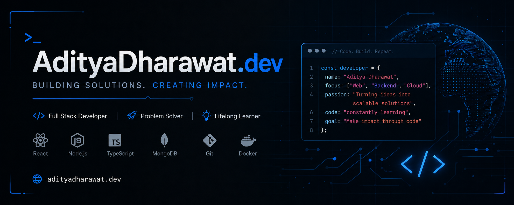

<p align="center">
  
</p>

<p align="center">
  <a href="https://adharawatdev.vercel.app/">
    
  </a>
  
  <a href="https://github.com/AdityaDharawat">
    
  </a>

  <a href="https://in.linkedin.com/in/aditya-dharawat-b94757321">
    
  </a>
</p>

<p align="center">
  
</p>

<p align="center">
  
  
  <a href="https://github.com/AdityaDharawat?tab=followers">
    
  </a>

  <a href="https://github.com/AdityaDharawat?tab=repositories">
    
  </a>
</p>

<p align="center">
  
</p>
<script src="https://platform.linkedin.com/badges/js/profile.js" async defer type="text/javascript"></script>
<div class="badge-base LI-profile-badge" data-locale="en_US" data-size="large" data-theme="light" data-type="HORIZONTAL" data-vanity="aditya-dharawat-b94757321" data-version="v1"><a class="badge-base__link LI-simple-link" href="https://in.linkedin.com/in/aditya-dharawat-b94757321?trk=profile-badge">Aditya Dharawat</a></div>
              

## Tech Stack

### Web Development

<p align="left">


</p>

### Programming Languages

<p align="left">


</p>

### AI / ML & Data

<p align="left">


</p>

### Frameworks & Libraries

<p align="left">


</p>

### Tools & DevOps

<p align="left">


</p>

<p align="center">
  
</p>

## Contribution Graph

<p align="center">
  
</p>

<p align="center">
  
</p>

## GitHub Analytics

<p align="center">
  
</p>

<p align="center">
  
</p>


## Current Focus

```python
class AdityaDharawat:

    def __init__(self):

        self.role = "AI Engineer"

        self.specializations = [
            "Machine Learning",
            "Deep Learning",
            "Computer Vision",
            "Full Stack Systems",
            "Cloud Infrastructure",
            "Autonomous AI Systems"
        ]

    def mission(self):

        return "Building scalable intelligent systems"
```

<p align="center">
  
</p>


## Connect

<table align="center" width="100%">
<tr>
<td align="center" width="25%">

<a href="https://github.com/AdityaDharawat">
  
</a>

</td>

<td align="center" width="25%">

<a href="https://in.linkedin.com/in/aditya-dharawat-b94757321">
  
</a>

</td>

<td align="center" width="25%">

<a href="https://adharawatdev.vercel.app/">
  
</a>

</td>

<td align="center" width="25%">

<a href="mailto:adharawatwork@gmail.com">
  
</a>

</td>
</tr>
</table>
